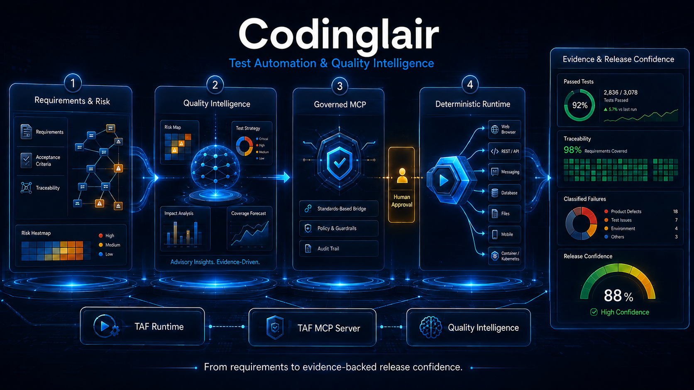

# Codinglair Test Automation Framework



Codinglair TAF is a modular Java test automation platform for building deterministic,
production-quality test suites across browser, API, database, messaging, files, mobile, and
observability boundaries.

The platform has two independently usable layers:

- **TAF Runtime** provides typed test capabilities, lifecycle management, environment composition,
  reporting, evidence collection, and framework integrations. Runtime works without MCP or AI.
- **TAF MCP Server** exposes governed, coarse-grained project and execution workflows to authorized
  MCP clients through STDIO or Streamable HTTP. It adds persistent jobs, approvals, authorization,
  audit, redaction, and isolated workers without exposing unrestricted shell, browser, SQL, or
  filesystem access.

The proprietary Quality Intelligence product area is planned but is not implemented or available
in this release.

## Highlights

- Java 25 and Spring Boot 4 modular architecture
- One isolated `TestSession` per TestNG invocation or Cucumber scenario
- Typed, named, lazily initialized controllers with deterministic reverse-order cleanup
- Conditional Spring Boot auto-configuration for independently consumable capabilities
- External and Testcontainers-managed environments with readiness, ownership, and cleanup policy
- Vendor-neutral reporting and sanitized evidence collection with an optional Allure adapter
- Versioned test definitions backed by files or MongoDB
- Secret references resolved only inside authorized deterministic execution boundaries
- Versioned MCP schemas with transport-equivalent STDIO and Streamable HTTP behavior
- Java API, schema, configuration, consumer-conformance, architecture, and documentation drift gates

## Capabilities

| Area | Available capabilities |
| --- | --- |
| Browser | Playwright controller, named browser instances, page/workflow composition, screenshots, DOM, trace, video, console and network evidence |
| API and contracts | REST, SOAP, OpenAPI and AsyncAPI validation, structured contract adapters |
| Data | JDBC assertions, versioned CSV/JSON/YAML test definitions, MongoDB definition provider, JDBC and MongoDB migrations |
| Messaging | Adapter-neutral messaging contracts with Kafka, RabbitMQ, and JMS/EMS-compatible adapters |
| Files | Bounded structured-file validation with path and workspace controls |
| Mobile | Native Android automation through Appium and UiAutomator2; emulator and authorized physical-device modes |
| Virtualization | WireMock-backed service virtualization provider |
| Observability | Log, metric, and trace assertions with bounded evidence |
| Runners | Independent TestNG and Cucumber lifecycle integrations |
| Reporting | TAF-neutral actions and evidence, failure classification/history, optional Allure single-file publishing |
| Environments | Preflight, external resources, isolated/shared Testcontainers lifecycles, dynamic connection metadata |
| MCP | Discovery, validation, scaffolding, build, execution, inspection, retrieval, cancellation, reporting, curated resources and prompts |
| Governance | OIDC/OAuth, RBAC, approvals, append-only audit, output bounds, redaction, persistent jobs, isolated execution workers |

See the [release capability matrix](docs/quick-start-capability-matrix.md) for artifact-level scope,
verification evidence, and known limitations.

## Architecture at a glance

`TestSession` owns invocation-scoped context, correlation, controllers, reporting, artifacts, and
cleanup. A typed and named `ControllerRegistry` creates controllers lazily. Controllers interact
with a test technology but do not provision infrastructure; `EnvironmentProvider` implementations
own resources and publish connection descriptions to the session.

Optional capabilities depend on lightweight Runtime contracts. Runtime never depends on MCP, and
Community modules never depend on proprietary modules. MCP composes Runtime through governed tools,
resources, prompts, security services, persistent jobs, and isolated workers.

## Getting started

Prerequisites are a Java 25 JDK, Git, repository/artifact access, and the checked-in Maven Wrapper.
Docker, browsers, databases, brokers, or Android/Appium are needed only for their corresponding
opt-in capabilities.

Verify the repository on Windows:

```powershell
.\mvnw.cmd -Pdocs verify
```

On macOS or Linux:

```bash
./mvnw -Pdocs verify
```

To build a consumer project, follow the [Quick Start](docs/quick-start.md). The executable
[Sauce Demo golden project](demos/playwright-sauce-demo/README.md) demonstrates Spring composition,
Playwright, TestNG, Cucumber, test definitions, preflight, reporting, and secret references.
Its default tests are deterministic; live profiles require authorized external prerequisites.

## Documentation

- [Installation and prerequisites](docs/reference/installation-and-prerequisites.md)
- [Quick Start](docs/quick-start.md)
- [Full reference documentation](docs/reference/README.md)
- [Runtime and configuration](docs/reference/runtime-and-configuration.md)
- [TestNG and Cucumber separation](docs/reference/testng-cucumber-separation.md)
- [Android and Appium setup](docs/reference/android-appium-setup.md)
- [MCP and security](docs/reference/mcp-and-security.md)
- [Operations and troubleshooting](docs/reference/operations-and-troubleshooting.md)
- [Extension SPI guide](docs/reference/extension-spi.md)
- [Maintainer guide](docs/reference/maintainer-guide.md)
- [Compatibility matrix](docs/engineering/compatibility-matrix.md)
- [Architecture decisions](docs/architecture/adrs/README.md)

## Repository layout

| Path | Purpose |
| --- | --- |
| `codinglair-taf-runtime/` | Runtime Core and optional deterministic capability modules |
| `taf-mcp-server/` | MCP contracts, jobs, security, workers, tools, resources, prompts, and transports |
| `codinglair-taf-bom/` | Consumer dependency management for released Community artifacts |
| `demos/playwright-sauce-demo/` | Executable golden consumer project |
| `blueprints/` | Governed consumer project templates |
| `release/` | Clean-consumer release smoke projects |
| `build-support/` | CI, release, policy, and documentation verification utilities |
| `docs/` | Architecture, operational guides, and public references |

## Verification and contribution

Use the Maven Wrapper and run the narrowest affected module verification before the full required
gate. Production behavior changes require unit tests; cross-boundary behavior requires integration
or contract tests; Spring auto-configuration conditions require context tests. Preserve lifecycle,
cleanup, concurrency, security, redaction, compatibility, and architecture coverage.

Proposed changes should follow the repository contribution guidance and be submitted through a
pull request. Run the applicable automated checks and include tests or documentation appropriate
to the change. A maintainer reviews each pull request before it is merged.

## License

Community artifacts are licensed under the [Apache License 2.0](LICENSE). Proprietary Quality
Intelligence components are outside the Community distribution and licensing boundary.
