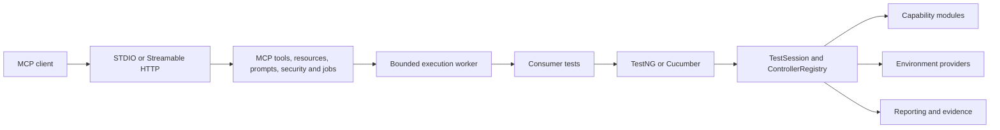

# Codinglair TAF <!-- taf-version -->`1.2.0` public solution architecture

## Scope

This document describes the current public architecture for TAF Runtime and the TAF MCP Server.
It intentionally excludes internal design rationale, commercial plans, proprietary strategy, and
unreleased roadmap commitments. Source, public schemas, Maven metadata, configuration metadata,
tests, and accepted ADRs remain authoritative.

## Product boundaries

TAF Runtime is deterministic and usable without MCP or AI. It supplies invocation-scoped test
lifecycle, optional controllers, environments, test definitions, secrets, reporting, and TestNG
and Cucumber integration. The MCP Server depends on Runtime and exposes governed framework
interaction; Runtime never depends on MCP. Community artifacts never depend on proprietary code.

## Starter and module architecture

Normal consumers select capability-oriented POM starters:

- `codinglair-taf-starter-web`, `-api`, `-database`, and `-mobile`;
- provider-neutral `codinglair-taf-starter-messaging`; and
- provider starters `-messaging-kafka`, `-rabbitmq`, `-jms`, and `-aws`.

Each top-level starter composes its capability with the shared Runtime/TestSession, environment,
secrets, test-definition, reporting, and TestNG foundation. Multiple starters share this foundation
through Maven mediation. The BOM aligns a compatible version set but installs no capability.
Starters contain no implementation classes and classpath presence does not activate a configured
controller or infrastructure resource.

Messaging provider starters transitively compose the generic messaging starter and exactly one
provider. The generic starter is useful to extension authors implementing the provider SPI but is
not operational by itself. Advanced consumers may continue to select supported direct modules for
fine-grained dependency control. Internal support, MCP server, worker, build, demo, and conformance
artifacts are not consumer capabilities. See the [dependency guide](../reference/consumer-dependencies.md)
and [machine-readable starter manifest](../reference/starter-capability-manifest-v1.json).

## Runtime lifecycle and capabilities

`TestSession` owns one invocation's named, typed `ControllerRegistry`, correlation context,
reporting, evidence, and scoped cleanup. Controllers initialize lazily, several instances of one
type may coexist, and cleanup is reverse ordered and idempotent. Controllers consume provisioned
resources; `EnvironmentProvider` implementations own provisioning and cleanup.

Optional public capabilities include Playwright web, REST and SOAP, JDBC, structured files,
Appium/Android, Kafka, RabbitMQ, JMS, EventBridge, SQS, contracts, WireMock, observability, data
migration, test-definition providers, and environment providers. Conditional auto-configuration
keeps unrelated technologies inactive and absent.

The AWS messaging module uses named profiles and independent EventBridge and SQS controller
instances. LocalStack provides deterministic local AWS integration and Testcontainers-based
qualification without changing the public controller contracts. This provider boundary permits
additional AWS integrations in later compatible versions; it makes no commitment to a specific
future capability.

## Configuration, secrets, reporting, and data

Spring Boot 4 is the composition baseline while Runtime Core remains Spring-light. Public settings
use typed configuration properties. Secrets cross consumer, test-definition, and MCP boundaries as
opaque references and resolve only inside an authorized execution boundary. Resolved values must
not enter logs, reports, screenshots, artifacts, MCP payloads, exceptions, or audit records.

TAF-owned reporting contracts remain vendor neutral. Allure is isolated in its adapter, and
controller evidence passes through `ArtifactCollector`. Test definitions are separate from
transient session state, results, large artifacts, audit records, and SUT data. MongoDB is the
recommended optional repository behind the test-definition SPI.

## MCP server architecture

The MCP Server provides coarse-grained discovery, validation, scaffolding/configuration services,
controlled build and execution, inspection, cancellation, resources, and reporting over versioned
contracts. A deployed transport exposes only the operations in its advertised tool catalog;
server-side scaffolding classes are not by themselves a callable MCP operation.
Tools do not expose unrestricted shell, SQL, browser, broker, or filesystem access. Security
centralizes OIDC/OAuth identity, authorization, approval, audit, size/time limits, workspace
confinement, and redaction. Long work uses bounded jobs and controlled artifact references.

STDIO and Streamable HTTP adapt the same governed services. STDIO is a client-launched local
subprocess: protocol frames use stdout and logs use stderr. Streamable HTTP uses `/mcp` behind the
configured resource-server boundary and is the supported transport for detached containers, CI,
and Kubernetes.

## Official container and deployment topology

The official image is `codinglair/codinglair-taf-mcp`. Immutable semantic tags such as `1.2.0` are
authoritative; `latest` is movable and prohibited for reproducible CI and supported Kubernetes.
One image provides mutually exclusive `stdio` and `streamable-http` profiles.

Local STDIO uses `docker run --rm -i` without a pseudo-TTY or published port. Streamable HTTP uses
port 8080 by default and publishes liveness/readiness groups. Docker and CI provide external
configuration, secret references, bounded writable workspace/state, non-root execution, and
graceful termination.

The supported Kubernetes reference uses Streamable HTTP, an immutable image digest, a ClusterIP
Service, probes, ConfigMap/Secret references, non-root/read-only security, resource bounds,
NetworkPolicy intent, and explicit writable volumes. The current single-replica profile has
process-local jobs, approvals, audit, and retained-result state; its `emptyDir` storage is not
durable. Multi-replica or HA operation requires those authorities to be externalized and qualified.
See the [container guide](../operations/mcp-container-deployment.md) and
[Kubernetes reference](../operations/mcp-kubernetes-reference.md).

## Compatibility and authoritative references

Java 25 and Spring Boot 4 are the public platform baseline. TestNG and Cucumber remain independent;
the new typed/named controller lifecycle is the approved lifecycle. Public compatibility is
governed by published contracts and the accepted ADRs, especially
[ADR-026](adrs/ADR-026_publish-capability-oriented-starters-with-provider-specific-messaging-starters.md),
[ADR-029](adrs/ADR-029_distribute-one-mcp-image-with-stdio-and-streamable-http-profiles.md), and
[ADR-030](adrs/ADR-030_gate-releases-with-external-starter-and-blueprint-conformance.md).

Consumer entry points are the [Quick Start](../quick-start.md),
[dependency guide](../reference/consumer-dependencies.md),
[blueprint architecture](consumer-project-blueprint.md), and MCP operational guides. These
documents describe supported 1.2.0 behavior and do not imply unreleased features.
