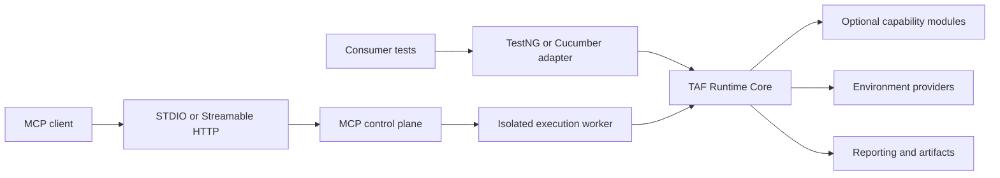

# Codinglair TAF public architecture

## Purpose and scope

This document describes the architecture implemented by the open-source Codinglair Test Automation Framework (TAF) repository. It defines the boundaries needed to consume, extend, operate, and maintain TAF Runtime and the TAF MCP Server. Source code, Maven POMs, configuration metadata, versioned schemas, tests, and accepted architecture decision records (ADRs) are authoritative.

The planned Quality Intelligence product is outside this repository and the Community distribution boundary. This document makes no functionality claims for that product area.

## Product and component overview

TAF has two independently usable open-source layers:

- **TAF Runtime** supplies invocation-scoped lifecycle, controllers, configuration, reporting, test data, environment management, and runner integrations. It does not require MCP or an AI client.
- **TAF MCP Server** supplies governed MCP contracts and coarse-grained workflows over Runtime. It adds persistent jobs, authorization, explicit approval where required, audit, bounded resources, isolated execution, and STDIO or Streamable HTTP transports.

## Maven organization

The root reactor and `codinglair-taf-bom` align versions for released artifacts. Modules are grouped by responsibility:

- **Foundation:** `codinglair-taf-common`, `codinglair-taf-runtime-core`, Runtime contracts, and the consumer conformance validator.
- **Test capabilities:** browser, REST, SOAP, database, files, service virtualization, observability, mobile, and messaging modules. Provider-neutral contracts are separated from provider adapters where multiple implementations are possible.
- **Data and infrastructure:** test-definition repositories, secret providers, environment providers, and data-migration adapters.
- **Execution integration:** independent TestNG and Cucumber adapters plus the optional Allure reporting adapter.
- **MCP control plane:** versioned contracts, jobs, security, worker, tools, resources, prompts, and transport adapters under `taf-mcp-server`.

Consumers select only the capability artifacts they need. Capability modules depend toward Runtime contracts; Runtime does not depend on MCP. The proprietary-boundary module must not become a dependency of Community modules.

## Runtime session and controller lifecycle

`TestSession` is the ownership boundary for one test invocation. It holds the session identifier, test and correlation context, environment access, reporting context, cleanup listeners, and a `ControllerRegistry`. A session may be created directly or by Spring composition through a `TestSessionFactory` and configured with `TestSessionConfigurer` implementations.

The registry identifies a controller by Java contract type and logical name. Registered controllers are initialized lazily on first access. The registry synchronizes initialization, retains an initialization failure, exposes typed health and state through each `TestController`, and rejects access after closure. This permits several independently configured instances of the same capability without global mutable controller state.

The runner integration owns the session it opens. Closing `TestSession` closes the controller registry first, then invokes cleanup listeners in reverse registration order. Controller cleanup is also reverse-order and idempotent. Cleanup attempts continue after a failure so later resources are not abandoned; failures are aggregated and returned to the owning runner. A controller owns its client resources, while an environment provider owns infrastructure it created. Controllers must not stop externally owned services.

See [ADR-003](adrs/ADR-003_approve-the-testcontroller-breaking-redesign.md) and [ADR-004](adrs/ADR-004_use-a-typed-named-controller-registry-within-testsession.md).

## Optional capabilities

Runtime Core contains technology-neutral lifecycle, reporting, preflight, history, failure, and controller contracts. Optional modules add Playwright browser automation; REST and SOAP clients; OpenAPI and AsyncAPI validation; JDBC and migration support; Kafka, RabbitMQ, and JMS-compatible messaging; Android automation through Appium; structured-file handling; WireMock virtualization; observability assertions; test-definition providers; and environment providers.

Each capability publishes conditional Spring Boot auto-configuration. Adding one adapter must not make unrelated technologies mandatory for Runtime consumers. See the [runtime and configuration reference](../reference/runtime-and-configuration.md) and [extension SPI guide](../reference/extension-spi.md).

## TestNG and Cucumber boundaries

TestNG and Cucumber are separate adapters over the same lifecycle contracts. The TestNG adapter opens one session per TestNG invocation and binds test metadata and typed definition input to that invocation. The Cucumber adapter opens one session per scenario and binds it through framework hooks. Neither runner delegates to or requires the other, and parallel execution must not share a session. Both propagate business-test and cleanup failures through their native result model. See [ADR-006](adrs/ADR-006_keep-testng-and-cucumber-runner-integrations-independent.md) and the [runner separation guide](../reference/testng-cucumber-separation.md).

## Configuration and Spring Boot composition

Spring Boot is the default composition mechanism, but Runtime Core remains usable without an application server. Auto-configuration is conditional on required classes, properties, and the absence of a consumer-provided bean. Consumers may replace extension beans using normal Spring composition.

Configuration uses typed `@ConfigurationProperties` classes and generated Spring configuration metadata. Secrets do not belong in ordinary configuration values. The [configuration reference](../reference/runtime-and-configuration.md) lists public prefixes and examples. [ADR-002](adrs/ADR-002_use-spring-boot-composition-with-a-lightweight-framework-core.md) defines the composition boundary.

## Reporting and artifacts

Runtime reporting contracts are vendor-neutral. Controller and workflow annotations emit structured actions through the Runtime reporter abstraction. Evidence collection applies size, type, path, and redaction controls before publication. Failure classification and execution history are Runtime services; adapters consume their results without owning lifecycle.

Allure is optional and its AspectJ integration does not leak into Runtime Core. See the [single-file Allure guide](../reporting/single-file-allure.md) and [ADR-005](adrs/ADR-005_keep-reporting-vendor-neutral-and-isolate-allure-and-aspectj.md).

## Environments and Testcontainers

Environment provisioning is separate from controllers. An `EnvironmentProvider` validates or starts a resource, performs readiness checks, and publishes connection metadata through `EnvironmentAccess`. Providers distinguish external resources from framework-owned resources and apply isolated or shared lifecycle policy. Testcontainers implementations are opt-in and require a container runtime.

Controllers consume connection descriptions but do not create or destroy the underlying service. The provider that creates a resource owns its cleanup. See [ADR-007](adrs/ADR-007_separate-environment-provisioning-from-controllers-and-support-testcontainers.md) and [operations and troubleshooting](../reference/operations-and-troubleshooting.md).

## Secrets and redaction

Test definitions and MCP inputs carry secret references, not resolved values. `taf-secrets-api` defines the resolution boundary; `taf-secrets-local` provides an authorized local implementation. Resolution occurs only inside deterministic execution and resolved material must not be returned to an MCP client, persisted in job state, or included in logs, reports, artifacts, exceptions, or audit metadata.

Runtime reporting and MCP security apply separate redaction pipelines at their output boundaries. Redaction is defense in depth, not permission to place plaintext secrets in model or transport context. See [ADR-011](adrs/ADR-011_keep-secrets-outside-model-and-mcp-context.md), the [MCP threat model](../security/mcp-threat-model.md), and the [MCP security reference](../reference/mcp-and-security.md).

## Test definitions and database ownership

`taf-test-definitions` owns versioned repository contracts and file providers for structured test input and expected output. `taf-test-definitions-mongodb` is an optional provider behind that SPI; consumers may supply another provider without changing runner or controller contracts.

TAF context data and system-under-test (SUT) data are separate planes. Framework repositories own their schema, migration, retention, and access policies. Database controllers act on explicitly configured SUT connections and do not treat SUT schemas as framework storage. Migration managers execute only declared, bounded migration locations against their designated target. See [ADR-008](adrs/ADR-008_use-mongodb-as-the-recommended-test-definition-store-behind-an-spi.md) and [ADR-022](adrs/ADR-022_separate-taf-context-and-sut-data-planes-and-govern-versioned-database-lifecycles.md).

## MCP architecture and security boundaries

The MCP Server is a control plane over versioned, bounded contracts:

- `taf-mcp-contracts` owns request, response, resource, prompt, and capability-catalog schemas.
- `taf-mcp-tools`, `taf-mcp-resources`, and `taf-mcp-prompts` expose coarse-grained operations, not a general shell, filesystem, SQL client, or browser session.
- `taf-mcp-jobs` owns persistent asynchronous job state and legal transitions.
- `taf-mcp-security` centralizes identity, role and capability authorization, approval policy, audit events, output limits, and redaction.
- `taf-execution-worker` prepares a bounded workspace, executes an allowlisted operation, applies time and output limits, and returns controlled artifact references.
- STDIO and Streamable HTTP adapt the same application contracts. HTTP adds the configured OIDC/OAuth resource-server boundary; transport choice must not change tool semantics or bypass authorization.

A request is authenticated at the transport boundary, authorized for the requested capability, checked for any required approval, and recorded by the audit service before controlled execution. Workers are isolated from the control-plane process boundary and reject path escapes and symbolic-link traversal. Responses contain bounded values or controlled `taf://` references rather than unrestricted host paths.

Authoritative references are the [MCP architecture records](mcp/), [authorization matrix](../security/mcp-authorization-matrix.md), [threat model](../security/mcp-threat-model.md), and [MCP operations and security guide](../reference/mcp-and-security.md). Wire contracts come from JSON schemas under `taf-mcp-server/taf-mcp-contracts/src/main/resources/META-INF/taf/mcp/schema/v1` and take precedence over prose.

## Deployment topology

The simplest topology is an in-process consumer test suite using Runtime modules and external or Testcontainers-managed dependencies. MCP STDIO adds a local control-plane process and isolated local worker for one trusted host. Streamable HTTP runs the control plane behind an identity-aware HTTP boundary and uses the same worker and contract layers. The repository also contains a functional Kind reference topology for deployment qualification; it is not required for Runtime consumers. See the [Kind deployment guide](../operations/kind-reference-deployment.md), [container image guide](../operations/container-images.md), and [release packaging guide](../operations/release-packaging.md).

## Extension and dependency rules

Supported extension points include controller implementations and factories, environment and secret providers, test-definition repositories, messaging adapters, reporters, preflight contributors, session configurers, and transport-independent MCP services. Extensions should:

1. depend on the narrowest provider-neutral contract module;
2. use `TestSession` ownership instead of static or cross-test mutable state;
3. keep provisioning in environment providers and technology operations in controllers;
4. preserve bounded output, redaction, authorization, and cleanup semantics;
5. expose conditional auto-configuration and allow consumer bean replacement; and
6. avoid dependencies from Runtime toward MCP, from neutral SPIs toward provider adapters, or from Community modules toward the proprietary boundary.

The [consumer project blueprint](consumer-project-blueprint.md), [consumer conformance checklist](consumer-conformance-checklist.md), and [extension SPI guide](../reference/extension-spi.md) provide implementation guidance. Architectural changes are recorded as focused ADRs in the [ADR index](adrs/README.md); this document links to those decisions rather than duplicating them.

## Compatibility baseline and authoritative documentation

The first public release establishes Codinglair TAF's compatibility baseline; there is no earlier public release contract to preserve. Current Java, Spring, and ecosystem support is documented in the [compatibility matrix](../engineering/compatibility-matrix.md).

Public entry points are the [Quick Start](../quick-start.md), [reference index](../reference/README.md), [security documentation](../security/), and [operational guides](../operations/). Released Java artifacts include generated Javadoc, Spring configuration metadata is generated from configuration types, and MCP and consumer-project JSON schemas are the authoritative generated or packaged API contracts.
